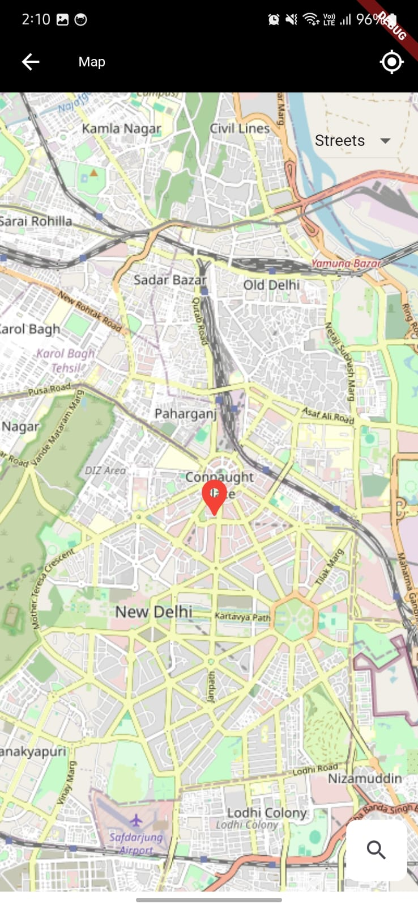

# Mapiano App

A Mini Flutter project for mapping and location services according to user's search.

## App Link:
### [Apk Link here](https://github.com/Mr-CodeBin/mapiano_app/blob/main/apk/app-release.apk)

## Table of Contents

- [Introduction](#introduction)
- [Features](#features)
- [Getting Started](#getting-started)
- [Prerequisites](#prerequisites)
- [Installation](#installation)
- [Usage](#usage)
- [Environment Variables](#environment-variables)


## Introduction

Mapiano App is a Flutter application that provides mapping and location services. It allows users to view maps, get current location, and search for locations using various map layers like streets, satellite, and terrain.

## Features

- Display maps with different layers (streets, satellite, terrain)
- Get current location
- Search for locations
- Display markers on the map

## Screenshots
## Screenshots


  

## Getting Started

This project is a starting point for a Flutter application. Follow the instructions below to set up and run the project.

### Prerequisites

- Flutter SDK: [Install Flutter](https://flutter.dev/docs/get-started/install)
- Dart SDK: Included with Flutter
- A code editor (e.g., Visual Studio Code, Android Studio)

### Installation

1. **Clone the repository:**

    ```sh
    git clone https://github.com/your-username/mapiano_app.git
    cd mapiano_app
    ```

2. **Install dependencies:**

    ```sh
    flutter pub get
    ```

3. **Set up environment variables:**

    Create a `.env` file in the root directory of the project and add your API keys:

    ```properties
    GOOGLE_MAPS_API_KEY=your_google_maps_api_key_here
    ```

4. **Run the application:**

    ```sh
    flutter run
    ```

## Usage

- **View Map:** The main screen displays the map with the selected layer.
- **Get Current Location:** Click on the location icon to fetch and display your current location on the map.
- **Search for Locations:** Use the search bar to find and display specific locations on the map.

## Environment Variables

The project uses environment variables to manage API keys securely. Follow the steps below to set up environment variables:

1. Create a `.env` file in the root directory of the project.
2. Add your API keys to the `.env` file:

    ```properties
    GOOGLE_MAPS_API_KEY=your_google_maps_api_key_here
    ```

3. Ensure the `.env` file is listed in your `.gitignore` file to prevent it from being committed to version control.


## How to Get a Google Maps API Key from Google Cloud Platform

### Step-by-Step Instructions

#### Step 1: Create a Google Cloud Platform Project

1. **Go to the Google Cloud Console**: [Google Cloud Console](https://console.cloud.google.com/).
2. **Sign in**: Sign in with your Google account.
3. **Create a New Project**:
   - Click on the project dropdown at the top of the page.
   - Click on "New Project".
   - Enter a project name and select your billing account.
   - Click "Create".

#### Step 2: Enable the Google Maps API

1. **Navigate to the API Library**:
   - In the Google Cloud Console, go to the "Navigation Menu" (three horizontal lines) on the top left.
   - Select "APIs & Services" > "Library".
2. **Enable the Maps API**:
   - In the API Library, search for "Maps JavaScript API".
   - Click on "Maps JavaScript API".
   - Click "Enable".

#### Step 3: Create API Credentials

1. **Navigate to the Credentials Page**:
   - In the Google Cloud Console, go to the "Navigation Menu".
   - Select "APIs & Services" > "Credentials".
2. **Create Credentials**:
   - Click on "Create Credentials" at the top of the page.
   - Select "API Key".
   - Your new API key will be created and displayed. Copy this key.

#### Step 4: Restrict Your API Key (Optional but Recommended)

1. **Restrict the API Key**:
   - Click on the "Edit" icon next to your API key.
   - Under "Key restrictions", select "HTTP referrers (web sites)".
   - Add the referrer(s) for your application (e.g., `http://localhost/*` for local development).
   - Under "API restrictions", select "Restrict key".
   - Choose the APIs you want to restrict (e.g., "Maps JavaScript API").
   - Click "Save".

#### Step 5: Add the API Key to Your Flutter Project

1. **Create a `.env` File**:
   - In the root directory of your Flutter project, create a file named `.env`.
   - Add your API key to the `.env` file:

     ```properties
     GOOGLE_MAPS_API_KEY=your_google_maps_api_key_here
     ```

2. **Ensure the `.env` File is Listed in `.gitignore`**:
   - Make sure your `.env` file is listed in your `.gitignore` file to prevent it from being committed to version control.

     ```gitignore
     # Miscellaneous
     *.class
     *.log
     *.pyc
     *.swp
     .DS_Store
     .atom/
     .buildlog/
     .history
     .svn/
     migrate_working_dir/
     *.env
     ```

3. **Load the Environment Variables in Your Code**:
   - Update your `main.dart` file to load the environment variables at the start of your application:

4. **Use the API Key in Your Code**:
   - Access the API key in your code using `dotenv.env['GOOGLE_MAPS_API_KEY']`.

     ```dart
     class LocationService {
       static Future<LatLng> getCoordinatesFromLocation(String location) async {
         final String apiKey = dotenv.env['GOOGLE_MAPS_API_KEY']!;
        ...
        ...
       }
     }
     ```

---

For help getting started with Flutter development, view the [online documentation](https://docs.flutter.dev/), which offers tutorials, samples, guidance on mobile development, and a full API reference.